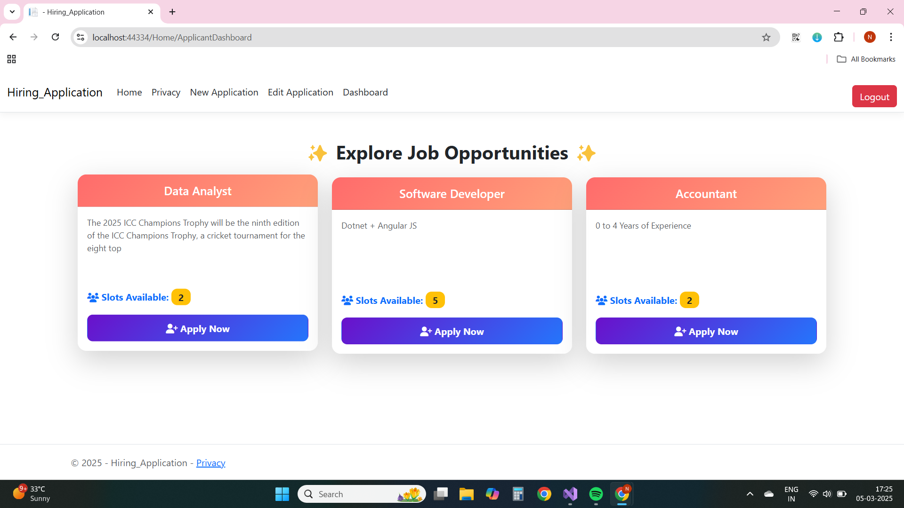
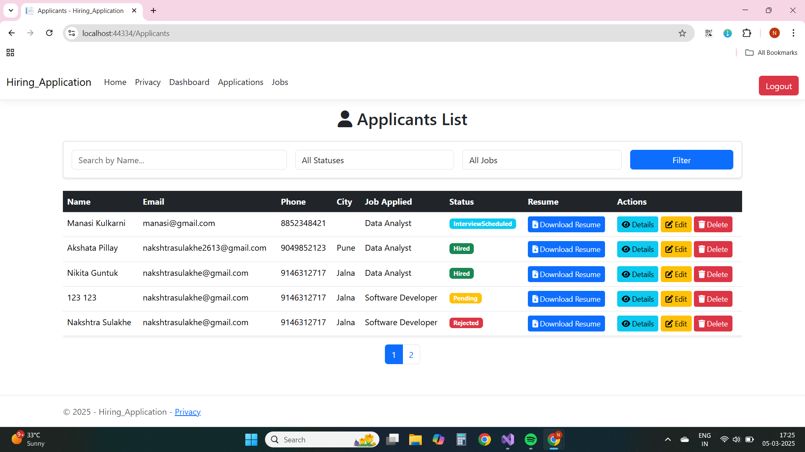
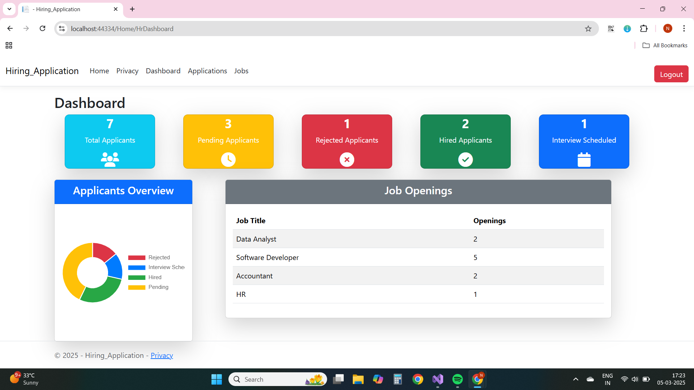
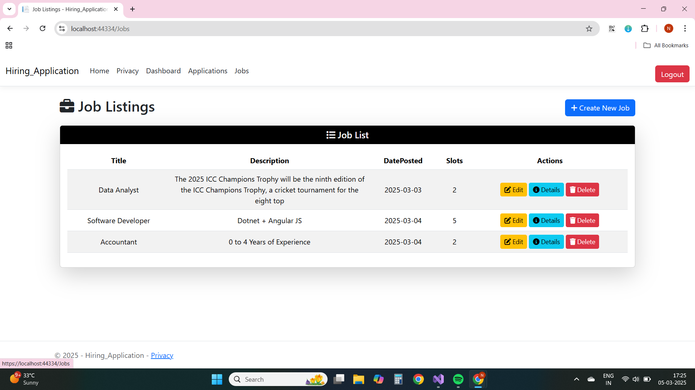

# Hiring Application

## Admin & HR Credentials

- **Admin**
  - **ID:** `admin@hiringapp.com`
  - **Password:** `Admin@123`
  
- **HR Manager**
  - **ID:** `hr@hiringapp.com`
  - **Password:** `HR@123`

- **Applicant**
- **ID:** `nakshtrasulakhe2613@gmail.com`
- **Password:** `Nakshtra@13`

#If Wants to create new applicant Id We can Create it by using register option


## Role-Based Authorization

This application includes **role-based authorization** to manage different user access levels.

### **Roles and Permissions:**
- **Admin:**
 - Admin Has All The Access of the application

- **HR Manager:**
  - Can post new jobs.
  - Can review & Delete applications.
  - Can update applicant status (Hired, Rejected).
  - Can view all applicants.
  - Can manage applicant data.

- **Applicant:**
  - Can **create** an application.
  - Can **view** available jobs.
  - Can **edit** application (before review).
  - Receives an **Applicant ID** via email upon application submission.
  - Must **validate the Applicant ID** to edit an application.
  - Receives **email notifications** when application status is updated.

## **Applicant Workflow**
1. **Submit Application**  
   - Applicants fill out and submit their job applications.  
   - They receive an **Applicant ID** via email.  

2. **Edit Application** (Before Review)  
   - Applicants must enter their **Applicant ID** for validation.  
   - If valid, they are redirected to the **Edit Application** page.  

3. **Application Review by HR**  
   - HR can update the applicant's status to **Hired** or **Rejected**.  
   - Applicants receive an **email notification** when their status is updated.

## **Email Notifications**
Applicants receive email notifications in these scenarios:
- **Application Submission** – Confirmation email with Applicant ID.
- **Application Status Update** – If **Hired** or **Rejected**, an email is sent.
- **New Job Posting** – All registered applicants receive an email about the new job.

## **Features**
✔️ **Role-based access control (HR & Applicant)**  
✔️ **Applicant ID verification for editing applications**  
✔️ **Email notifications** for application status updates & job postings  
✔️ **Pagination** – Limits applicants displayed per page  
✔️ **Filter** – Applicants Can Be filtered by status 
✔️ **Search** – Applicants Can Be searched by name 
✔️ **File Upload/Download** – Applicants can upload resumes, and HR can download them  

## **Installation & Setup**
1. Clone the repository:  
   ```bash
   git clone https://github.com/your-repo/hiring-application.git
   cd hiring-application

## Screenshots

### Applicant Dashboard  


### Applicant List View  


### HR Dashboard  


### Job List View  

